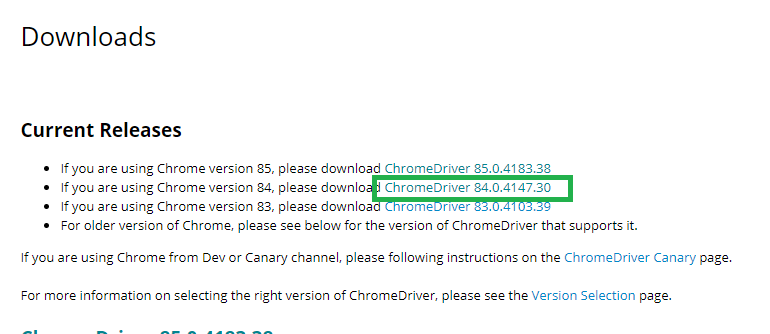

# 画像検索して保存するやつ

## install

* google chromeをインストールする

### chrome バージョン確認

```bash
google-chrome --version
Google Chrome 84.0.4147.89
```
### chromedriver install

1. [ここ](https://chromedriver.chromium.org/downloads)から`chromedriver`をダウンロード、ここに解凍する
1. 該当するバージョンのバイナリZIPをダウンロード
1. ダウンロードしたら解凍する



### selenium install

```bash
sudo pip3 install selenium
```
## Usage


```bash
python3 image_get.py 検索キーワード
```

| param | description | default|
| ----- |  ---------- | -----  |
| k     | 検索キーワード | - |
| -c    | 上位から保存する数 | 3 |
| -o    | 出力先ディレクトリ(自動作成) | data |
| -l    | ログファイル名 | logs.txt | 


### examples

```bash
python3 image_get.py 猫 #猫の画像を上位3つ, dataディレクトリに保存
python3 image_get.py 猫 100  #猫の画像を上位100こ, dataディレクトリに保存
```
